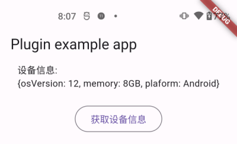

# Unify：Flutter-原生混合通信

Unify 是一个高效、灵活、易用的 Flutter 混合开发框架，旨在解决 Flutter 与原生模块之间的通信问题。它支持平台无关的模块抽象、灵活的实现注入、自动代码生成等特性，显著提升了混合开发的效率，降低了维护成本。

Unify 由滴滴出行国际化外卖团队自研，目前已经广泛应用于滴滴国际化外卖及国际化出行业务，有力支撑了业务的 Flutter 化进程。 

Unify 的亮点特性包括:

- **平台无关的模块抽象**: 允许开发者使用 Dart 语言声明与平台无关的模块接口与实体。  
- **灵活的实现注入**: 开发者可以灵活地选择注入原生实现（Android/iOS）或 Flutter 实现。
- **自动代码生成**: 借助强大的代码生成引擎,Unify 可以自动生成 Flutter、Android、iOS 多平台下统一调用的 SDK。

下面是一个使用 Unify 声明原生模块的示例:

```dart
@UniNativeModule()
abstract class DeviceInfoService {
  Future<DeviceInfoModel> getDeviceInfo();
}
```

通过 Unify，上面的 Dart 接口可以自动映射到 Android 和 iOS 平台，开发者只需专注于各平台下的具体实现即可。在 Flutter 中使用时，调用方式就像普通的 Flutter 模块一样简单、直观:

```dart
DeviceInfoService.getDeviceInfo().then((deviceInfoModel) {
  print("${deviceInfoModel.encode()}");
});
```

Unify 的整体原理如下：


Unify 能够很好地解决 Flutter 混合开发下的一些常见问题，例如:

- 大量原生模块高效导入 Flutter
- 大量 Flutter 模块高效导入原生  
- 解决大量 Channel 难以维护的问题
- 原生与 Flutter 并存下的混合架构分层

**立即开始使用 Unify,让混合开发更高效!**


## Installation

Unify 是一个使用 Dart 开发的命令。

在 Flutter 工程的 `pubspec.yaml` 中添加 `dev_dependencies`：

```yaml
dev_dependencies:
  unify_flutter: latest_version
```

> 注：目前 Unify 尚未发布 pub.dev，可先通过 git 依赖方式体验。后续会正式发布 pub.dev，敬请期待。

git 依赖：

```yaml
dev_dependencies:
  unify_flutter:
    git: git@github.com:maxiee/Unify.git
```

执行 `flutter pub get` 拉取依赖。之后即可运行 Unify：

```sh
flutter pub run unify_flutter api
```

> 注：执行 Unify 命令通常需伴随一系列参数，具体可使用方式可参见 Getting Started。


## Getting Started

跟随以下步骤,快速开始使用 Unify 将一个原生 SDK(包含 Android、iOS 版本)统一封装并导入 Flutter 中。 

> 可参考实例代码: `example/01_uninativemodule_demo`

### 前置条件

开始之前，请确保开发环境满足以下条件:

- 已安装 Flutter3 以上版本
- 对于 Android 开发，已配置 Android 开发环境
- 对于 iOS 开发，已配置 iOS 开发环境

### 步骤 1: Clone 示例项目

首先 clone Unify 项目，并进入示例目录:

```sh
git clone git@github.com:didi/Unify.git
cd ./Unify/01_uninativemodule_demo
```

`01_uninativemodule_demo` 是一个标准的 Flutter App 项目。其功能为:

- 原生侧（Android/iOS）分别实现一个系统信息模块
- 使用 Unify 将原生模块统一封装并导入 Flutter 
- 在 Flutter 侧进行统一调用

### 步骤 2: 声明 Unify 模块

注意到项目根目录下有一个 `interface` 目录，这是声明 Unify 模块的地方。它包含两个文件:

1. `device_info_service.dart` - 声明原生模块:

```dart
// device_info_service.dart
@UniNativeModule()
abstract class DeviceInfoService {
  /// 获取设备信息
  Future<DeviceInfoModel> getDeviceInfo();
}
```

`@UniNativeModule` 注解表示该模块的实现由原生侧提供。

2. `device_info_model.dart` - 声明返回值 Model:

```dart
// device_info_model.dart
@UniModel()
class DeviceInfoModel {
  /// 系统版本
  String? osVersion;

  /// 内存信息
  String? memory;

  /// 手机型号
  String? plaform;
}
```

`@UniModel` 注解表示这是一个跨平台的数据模型。

### 步骤 3: 生成跨平台代码

接口声明完成后，执行如下命令生成跨平台代码:

```sh
flutter pub run unify api\
  --input=`pwd`/interface \
  --dart_out=`pwd`/lib \
  --java_out=`pwd`/android/src/main/java/com/example/uninativemodule_demo \
  --java_package=com.example.uninativemodule_demo \
  --oc_out=`pwd`/ios/Classes \
  --dart_null_safety=true \
  --uniapi_prefix=UD
```

命令选项说明:

|参数|说明|是否必选|
|---|---|---|
|`input`|指定 Unify 接口声明目录|Y|
|`dart_out`|指定 Dart 代码输出目录|Y|
|`java_out`|指定 Java 代码输出目录|Android 必选|
|`java_package`|指定生成的 Java 代码的包名|Android 必选|
|`oc_out`|指定 Objective-C 代码输出目录|iOS 必选|
|`dart_null_safety`|是否生成空安全的 Dart 代码|Y|
|`uniapi_prefix`|生成代码前缀，避免库间冲突|N|

执行后,Unify 会在对应目录下生成各平台代码。

### 步骤 4: 实现原生模块

生成的原生模块接口,需要我们补充具体实现:

- Android 平台实现类：[DeviceInfoServiceImpl.java](https://github.com/didi/Unify/blob/master/example/01_uninativemodule_demo/example/android/app/src/main/java/com/example/uninativemodule_demo_example/DeviceInfoServiceImpl.java)
- Android 平台注册实现：[MainActivity.java](https://github.com/didi/Unify/blob/master/example/01_uninativemodule_demo/example/android/app/src/main/java/com/example/uninativemodule_demo_example/MainActivity.java)

- iOS 平台实现类：[DeviceInfoServiceVendor.h](https://github.com/didi/Unify/blob/master/example/01_uninativemodule_demo/example/ios/Runner/DeviceInfoServiceVendor.h)、[DeviceInfoServiceVendor.m](https://github.com/didi/Unify/blob/master/example/01_uninativemodule_demo/example/ios/Runner/DeviceInfoServiceVendor.m)
- iOS 平台注册实现：[AppDelegate.m](https://github.com/didi/Unify/blob/master/example/01_uninativemodule_demo/example/ios/Runner/AppDelegate.m)

可参考示例代码进行实现。

### 步骤 5: 在 Flutter 中调用

一切就绪! 在 Flutter 代码中，现在可以直接调用 Unify 封装的原生模块了:

```dart
OutlinedButton(
  child: const Text("获取设备信息"),
  onPressed: () {
    DeviceInfoService.getDeviceInfo().then((deviceInfoModel) {
      setState(() {
        _platformVersion = "\n${deviceInfoModel.encode()}";
      });
    });
  },
),
```



至此,你已经成功通过 Unify 将一个原生模块导入并在 Flutter 中使用。就像调用 Flutter 模块一样简单、直观！

### 小结

通过这个示例,我们体验了 Unify 带来的价值:

1. `统一模块声明`: 在任何平台下，统一的模块接口声明，避免实现不一致
2. `UniModel`: 支持跨平台透明传输的数据模型
3. 相比 Flutter 原生 Channel 方式:
    1. 避免手动解析参数易出错
    2. Android、iOS 双端自动对齐
    3. 大量 Channel 自动生成，易于维护 
    4. 复杂实体无缝序列化，降低管理成本

## Decision Tree

我们总结了如下决策流程：


## More Examples

在 Getting Started 中，给出了最基础、使用场景最多的【原生实现导入 Flutter】。Unify 的能力远不止这些。从简单的单一 SDK 封装，到复杂的企业级 App 大规模模块导出，Unify 都能够支持。

我们通过实例应用的方式，对这些典型场景及业务模式进行介绍：

|案例|说明|适用场景|
|---|---|---|
|[01_uninativemodule_demo](https://github.com/didi/Unify/tree/master/example/01_uninativemodule_demo)|UniNativeModule 演示|如何将一个原生模块（Android/iOS双端实现）高效导入Flutter、实现统一调用|
|[02_unifluttermodule_demo](https://github.com/didi/Unify/tree/master/example/02_unifluttermodule_demo)|UniFlutterModule 演示|如何将一个 Flutter 模块，高效导入原生（Android/iOS），实现统一调用|

## Documentation

对于更多高级用法，请参见详细文档。

* 查看文档请参考 [Unify文档](doc/README.md)。
* 想快速体验如何使用，请参考 [快速开始](doc/02.快速开始/README.md)。
* 想了解 Unify 提供哪些能力，请参考 [基础能力](doc/06.基础能力/README.md)。
* 想了解 Unify 模块设计原理，请参考 [原理概述](doc/08.原理概述/README.md)。
* 想了解更多 Unify CLI 的使用说明，请参考 [CLI 使用教程](doc/04.CLI 使用教程.md)。

> 注：目前我们也在积极整理文档，如果在使用、理解上有任何问题，欢迎提交 Issue 反馈、交流！

## 协议


Unify 基于 Apache-2.0 协议进行分发和使用，更多信息参见 [协议文件](LICENSE)。

## 成员

研发团队：

[maxiee](https://github.com/maxiee),
[zhugeafanti](https://github.com/zhugeafanti),
[piglet696](https://github.com/piglet696),
[zhaoxiaochun](https://github.com/zhaoxiaochun),
[ChengCheng-Hello](https://github.com/ChengCheng-Hello),
[windChaser618](https://github.com/windChaser618),
[bql88601485](https://github.com/bql88601485),
[newbiechen1024](https://github.com/newbiechen1024),
[xizhilang66](https://github.com/xizhilang66),
[UCPHszf](https://github.com/UCPHszf),
[QianfeiSir](https://github.com/QianfeiSir),
[jiawei1203](https://github.com/jiawei1203),
[Whanter](https://github.com/Whanter)

## Contribution

如果在使用、理解上有任何问题，欢迎提交 Issue 反馈、交流！

欢迎您的交流、贡献！

